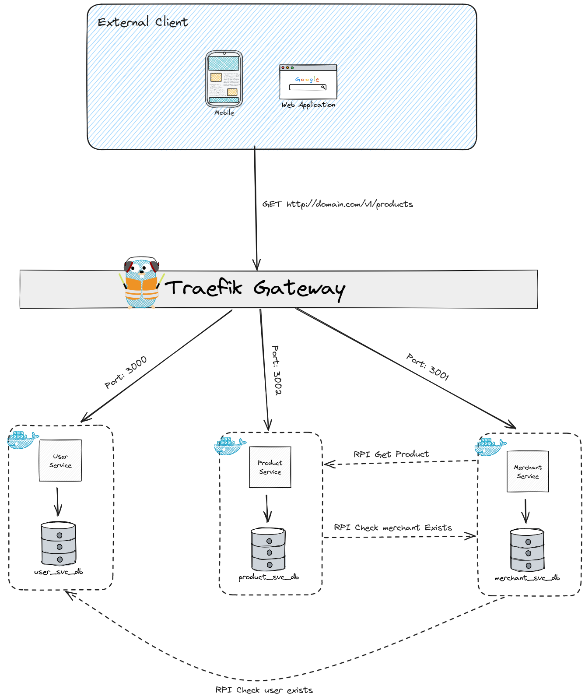

# Golang Microservice

> Notes: This microservice is not ready for production; it is intended solely for demonstration purposes.

## Requirement
* Go version 1.20
* Docker

## Architecture



## How to Run

### Using Docker

```bash
$ docker compose up -d
```

### Local Machine

Change directory to each root projects

```bash
$ cd user_svc
```

```bash
$ make run
```

## API Docs

API Documentation use swagger, you can access from:

```bash
http://localhost:8081/v1/users/docs
http://localhost:8081/v1/products/docs
http://localhost:8081/v1/merchants/docs
```
